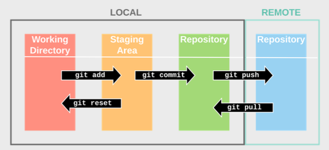

# How to use git

1. create Repository online and clone into a folder where you want it

	git clone https://reponame.git

2. check the status of the Staging Area:

	git status

3. to add a file

	git add file1 file2

if the file is changed it needs to be added again

4. commit file = add it to LOCAL Repository

	git commit -m "Describe the changes"

5. push file = add it to the REMOTE Repository

	push file

username is my username
password is my token that I generated for this repository

I only have to put in the password 1x per session
